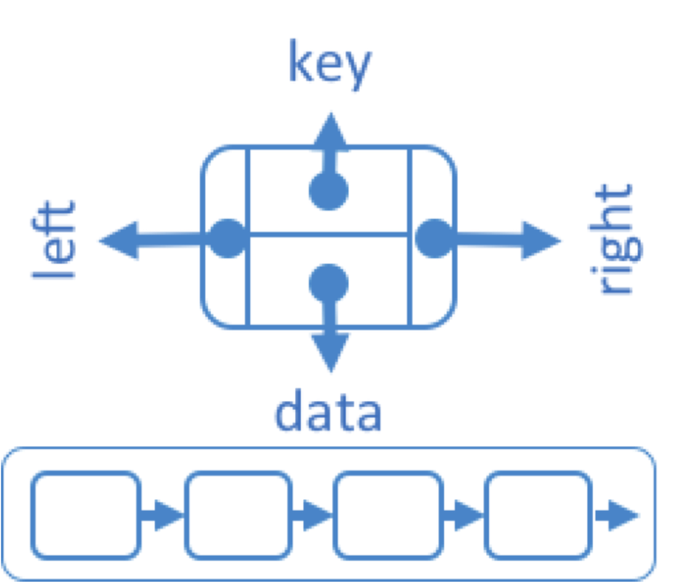
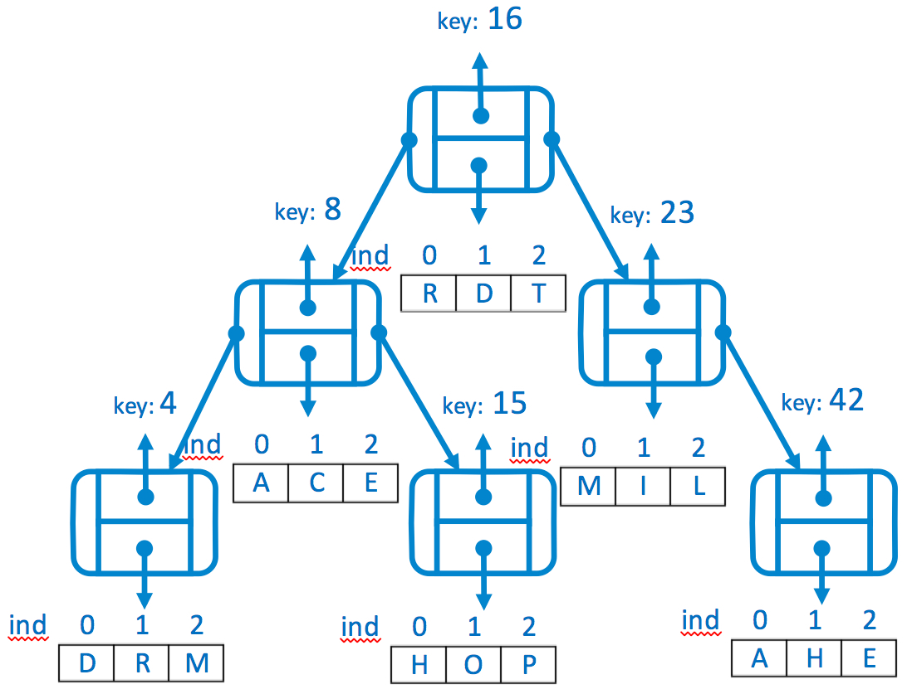

# Exercise 05 -- Binary Search Tree
### Submission Deadline: December 16, 2018 at 3 pm

The overall goal of the fifth assignment is to build a *Binary Search Tree* that is able to store data in a `LinkedList`.
A *binary search tree* is defined as binary tree with the requirement that, for each `node N` with `key k`:
* all nodes in N’s left subtree have a key *less than k*
* all nodes in N’s right subtree hve a key *greater than k*   

See also the slides of the last lecture (about trees) for more details on binary search trees and the respective operations!

As prerequiste for this task, make yourself also familiar with the Java implementation of `java.util.LinkedList`.

For solving the tasks, this repository contains:

* a `src` Folder containing the (java) source file `LinkedTree.java` that serves as both, a template and starting point for your solution.
	
	**IMPORTANT: Make use of the provided class for your solution. Also, do not change the method signature on your own (there is a good reason for the provided signatures). Otherwise, we will account for a malus (i.e., reducing your points even if the solution is basically correct)!**
* a `test` folder, containing the tests for the implementation. These tests are implemented by the instructor and can be used by you to improve your code. Also, these tests are kind of initial sanity check for assessing the assignment.
*Remember that you can run the test file(s) as well to check whether your implementation works correctly.* 
**Run the tests to check whether your solutions work correctly. But do not touch/change them!**
* some more files needed for handling the project in Eclipse (or for proper push/pull the repository). See the slides for more details. In general, the other files **should not be changed or deleted, if you do not really know what you are doing**!!

In the following, you will find the particular tasks to be solved.

---


## Task 5-01: LinkedTree data structure

<table border="0">
  <tr>
   <td>
   
Please write a `public class LinkedTree <T>` containing the *Inner Node Class* `private class Node<E>` as follows:
```
private class Node<E> {
   private int            key; //the key field
   private LinkedList<E> data; //list of data associated with a key          
   private Node<E>       left; //reference to the left child
   private Node<E>      right; //reference to the right child
   
   private Node(int key, E element, 
                Node<E> leftChild, Node<E> rightChild) {
      this.key   = key;
      this.data  = new LinkedList<E>();
      this.left  = leftChild; 
      this.right = rightChild; 
   }

   private Node(int key, E element) {
      this(key, data, null, null);
   }
}

``` 
This class allows to create nodes in the form of:		 


</td>

<td>1 Point</td>
  </tr>
<tr>
  <td>

Please implement the following function to *insert* the specified `(key, element)` pair in the tree so that the tree *remains a binary search tree*.
```
public void insert(int key, E element){ … }
```
The method should work in the following way:

`insert(k,e)`: search for a node whose key is `k`  
&ensp; **if** (a node with the key `k` exist)  
&ensp; &ensp; add element `e` to the `LinkedList data` associated with the key `k`  
&ensp; **else**  
&ensp;&ensp; insert a new `node(key k, element e)` in the binary search tree so that it is still a binary search tree.


</td>
  <td>3 Points</td>
</tr>
<tr>
  <td>
  
  Please implement the following function to search for the specific key in the binary search tree.
  
  ```
  public LinkedList<E> search(int key){ … }
  ```
  The method should work in the following way:
  
  `search(k)`:  returns the *list of data* associated with the *key k* 
  
  </td>
  <td>2 Points</td>
</tr>
</table>

## Task 5-02: Traversing the LinkedTree

<table border="0">
</tr>
<tr>
  <td>

 Please implement the following functions to print an element of the `LinkedList data` associated with the keys of the tree, implemented in the previous task, in the order given by a *preorder, postorder and inorder traversal*.

```
public LinkedList<E> preorder(int ind){ … }

public LinkedList<E> postorder (int ind) { … }

public LinkedList<E> inorder (int ind) { … }
```
The particular methods should work in the following way (regarding the processing part of a node):

`preorder(ind):` perform the preorder traversal, starting at the root of the tree. Then, for each node                                      
**if** ( size of `LinkedList data` is greater than index `ind`)  
&ensp; &ensp; store the element of the `LinkedList data` having the index `ind` in an appropriate data structure of type `LinkedList<E>`    
When the traversal is finished, return the `LinkedList`, containing the processed elements.

`postorder(ind)`:perform the postorder traversal for the root of the tree for each node                                      
**if** ( size of `LinkedList data` is greater than index `ind`)             
&ensp; &ensp; store the element of the `LinkedList data` having the index `ind` in an appropriate data structure of type `LinkedList<E>`    
When the traversal is finished, return the `LinkedList`, containing the processed elements.

`inorder (ind)`:perform the inorder traversal for the root of the tree for each node                                      
**if** ( size of `LinkedList data` is greater than index `ind`)             
&ensp; &ensp; store the element of the `LinkedList data` having the index `ind` in an appropriate data structure of type `LinkedList<E>`    
When the traversal is finished, return the `LinkedList`, containing the processed elements.

</td>
  <td>4 Points</td>
</tr>
</table>

## Task 5-03: Deletion & Using the LinkedTree

<table border="0">
</tr>
<tr>
  <td>

Please implement the following function to *delete* the node containing the `(key, element)` pair with the specified key so that the tree *remains a binary search tree*.
```
public LinkedList<E> delete(int key){ … }
```
The method should work in the following way: 

`delete(k)`:  
1. search for a node whose key is `k`.
1. delete the node with the key `k` from the binary tree 
1. return the list of data associated with the key `k`         

  </td>
  <td>3 points</td>
</tr>
<tr>
  <td>

Within the `main` method (in class `Main.java`), please create the binary search tree as depicted below. 



What is the output of the following Java code for the binary tree (when printing the result to standard output):
```
   tree.inorderPrint(0);
   
   tree.postorderPrint(1);
   
   tree.preorderPrint(2);

```
</td>
  <td>1 Point</td>
</tr>
</table>
